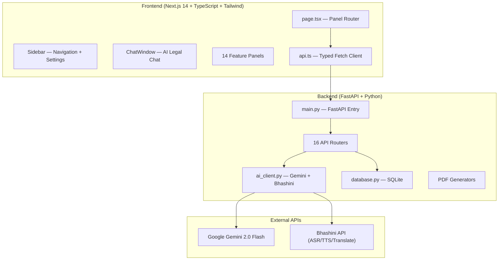
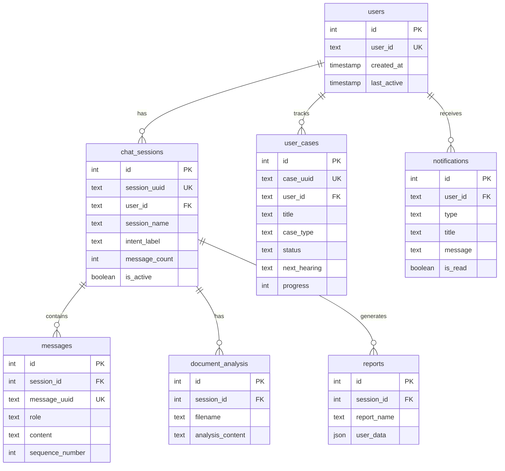

# ⚖️ Nyay-Sahayak v3.2.0 — Project Walkthrough

**Nyay-Sahayak** (न्याय सहायक — "Legal Helper") is an AI-powered Indian legal assistant that helps citizens understand their legal rights, file complaints, find lawyers, and navigate the Indian legal system — in **11 Indian languages**.

---

## Architecture Overview

---

## Tech Stack

| Layer | Technology |
|-------|-----------|
| **Frontend** | Next.js 14, TypeScript, Tailwind CSS, React 18 |
| **Backend** | FastAPI 0.115, Uvicorn, Python |
| **AI Engine** | Google Gemini 2.0 Flash (legal reasoning) |
| **Voice/Translation** | Bhashini API (ASR, TTS, Translation — 11 languages) |
| **Database** | SQLite (via custom ORM in `database.py`) |
| **PDF Generation** | ReportLab (FIR, reports, RTI, legal templates) |
| **Auth** | JWT (python-jose) + bcrypt (passlib) |
| **Deployment** | Render (backend) + Vercel (frontend) |

---

## Backend Structure

### Entry Point — [main.py](file:///Users/devthakran/Desktop/nyayshakti_enhanced/backend/main.py)
- FastAPI app with lifespan manager (init DB, auth tables, fonts)
- CORS middleware (currently `allow_origins=["*"]`)
- 16 routers all mounted under `/api`

### API Routers (16 total)

| Router | Endpoints | Purpose |
|--------|-----------|---------|
| [chat.py](file:///Users/devthakran/Desktop/nyayshakti_enhanced/backend/routers/chat.py) | `/api/chat/message`, `/languages`, `/status`, `/clear-context` | Core AI chat with Gemini |
| [sessions.py](file:///Users/devthakran/Desktop/nyayshakti_enhanced/backend/routers/sessions.py) | `/api/sessions/{user_id}`, `/{id}/messages` | Chat history management |
| [documents.py](file:///Users/devthakran/Desktop/nyayshakti_enhanced/backend/routers/documents.py) | `/api/documents/analyze`, `/fir`, `/report` | Document upload, analysis, PDF gen |
| [voice.py](file:///Users/devthakran/Desktop/nyayshakti_enhanced/backend/routers/voice.py) | `/api/voice/asr`, `/tts` | Speech-to-text, text-to-speech (Bhashini) |
| [locations.py](file:///Users/devthakran/Desktop/nyayshakti_enhanced/backend/routers/locations.py) | `/api/locations/search`, `/states`, `/commission/{state}` | Legal aid centers, helplines |
| [auth.py](file:///Users/devthakran/Desktop/nyayshakti_enhanced/backend/routers/auth.py) | `/api/auth/login`, `/signup`, `/me` | JWT authentication |
| [admin.py](file:///Users/devthakran/Desktop/nyayshakti_enhanced/backend/routers/admin.py) | `/api/admin/...` | Admin panel APIs |
| [rights.py](file:///Users/devthakran/Desktop/nyayshakti_enhanced/backend/routers/rights.py) | `/api/rights/...` | Fundamental rights data |
| [ocr.py](file:///Users/devthakran/Desktop/nyayshakti_enhanced/backend/routers/ocr.py) | `/api/ocr/...` | Document OCR scanning |
| [news.py](file:///Users/devthakran/Desktop/nyayshakti_enhanced/backend/routers/news.py) | `/api/news/...` | Legal news feed |
| [flows.py](file:///Users/devthakran/Desktop/nyayshakti_enhanced/backend/routers/flows.py) | `/api/flows/...` | Step-by-step guided legal flows |
| [lawyers.py](file:///Users/devthakran/Desktop/nyayshakti_enhanced/backend/routers/lawyers.py) | `/api/lawyers/...` | Lawyer finder/directory |
| [cases.py](file:///Users/devthakran/Desktop/nyayshakti_enhanced/backend/routers/cases.py) | `/api/cases/...` | Personal case tracking |
| [dashboard.py](file:///Users/devthakran/Desktop/nyayshakti_enhanced/backend/routers/dashboard.py) | `/api/dashboard/{userId}` | User dashboard & analytics |
| [search.py](file:///Users/devthakran/Desktop/nyayshakti_enhanced/backend/routers/search.py) | `/api/search/legal`, `/suggestions` | AI-powered legal search |

### Utils (Core Logic)

| File | Purpose |
|------|---------|
| [ai_client.py](file:///Users/devthakran/Desktop/nyayshakti_enhanced/backend/utils/ai_client.py) | Gemini AI + Bhashini (ASR/TTS/Translation). Handles model fallback (gemini-2.0-flash → gemini-1.5-flash → gemini-pro), emergency detection, quota handling, multilingual system prompts |
| [database.py](file:///Users/devthakran/Desktop/nyayshakti_enhanced/backend/utils/database.py) | SQLite ORM — 7 tables: users, chat_sessions, messages, document_analysis, reports, user_cases, notifications |
| [auth.py](file:///Users/devthakran/Desktop/nyayshakti_enhanced/backend/utils/auth.py) | JWT token creation/verification, password hashing, admin seeding |
| [suggestions.py](file:///Users/devthakran/Desktop/nyayshakti_enhanced/backend/utils/suggestions.py) | Contextual suggestion chips (follow-ups, helplines, related cases) |
| [fir_generator.py](file:///Users/devthakran/Desktop/nyayshakti_enhanced/backend/utils/fir_generator.py) | FIR (First Information Report) PDF generation |
| [pdf_generator.py](file:///Users/devthakran/Desktop/nyayshakti_enhanced/backend/utils/pdf_generator.py) | Comprehensive legal report PDF generation |
| [rti_generator.py](file:///Users/devthakran/Desktop/nyayshakti_enhanced/backend/utils/rti_generator.py) | RTI (Right to Information) application generator |
| [legal_templates.py](file:///Users/devthakran/Desktop/nyayshakti_enhanced/backend/utils/legal_templates.py) | Legal notice, petition, complaint templates |
| [rights_data.py](file:///Users/devthakran/Desktop/nyayshakti_enhanced/backend/utils/rights_data.py) | Indian fundamental rights data/content |
| [context_memory.py](file:///Users/devthakran/Desktop/nyayshakti_enhanced/backend/utils/context_memory.py) | Per-user conversation context tracking |
| [performance_tracker.py](file:///Users/devthakran/Desktop/nyayshakti_enhanced/backend/utils/performance_tracker.py) | API performance monitoring |

---

## Frontend Structure

### Main App — [page.tsx](file:///Users/devthakran/Desktop/nyayshakti_enhanced/frontend/src/app/page.tsx)
- Panel-based routing (14 panels): `chat`, `location`, `docs`, `rights`, `rti`, `ocr`, `news`, `flow`, `lawyers`, `templates`, `cases`, `fir`, `dashboard`, `search`
- Auth-gated (redirects to `/login` if not authenticated)
- Responsive sidebar with mobile overlay

### Components (23 total)

| Component | Size | Purpose |
|-----------|------|---------|
| [ChatWindow.tsx](file:///Users/devthakran/Desktop/nyayshakti_enhanced/frontend/src/components/ChatWindow.tsx) | 10.9KB | Main AI chat interface with message handling |
| [Sidebar.tsx](file:///Users/devthakran/Desktop/nyayshakti_enhanced/frontend/src/components/Sidebar.tsx) | 20.1KB | Navigation, language settings, chat history |
| [Dashboard.tsx](file:///Users/devthakran/Desktop/nyayshakti_enhanced/frontend/src/components/Dashboard.tsx) | 25.2KB | User analytics, case overview, activity stats |
| [FIRPanel.tsx](file:///Users/devthakran/Desktop/nyayshakti_enhanced/frontend/src/components/FIRPanel.tsx) | 23.1KB | FIR filing wizard |
| [LegalTemplates.tsx](file:///Users/devthakran/Desktop/nyayshakti_enhanced/frontend/src/components/LegalTemplates.tsx) | 32.3KB | Legal document template generator |
| [LegalSearch.tsx](file:///Users/devthakran/Desktop/nyayshakti_enhanced/frontend/src/components/LegalSearch.tsx) | 14.5KB | AI-powered legal search |
| [LawyerFinder.tsx](file:///Users/devthakran/Desktop/nyayshakti_enhanced/frontend/src/components/LawyerFinder.tsx) | 14.5KB | Lawyer directory and finder |
| [GuidedFlow.tsx](file:///Users/devthakran/Desktop/nyayshakti_enhanced/frontend/src/components/GuidedFlow.tsx) | 12.7KB | Step-by-step legal process wizard |
| [RTIPanel.tsx](file:///Users/devthakran/Desktop/nyayshakti_enhanced/frontend/src/components/RTIPanel.tsx) | 13.4KB | RTI application form |
| [OCRPanel.tsx](file:///Users/devthakran/Desktop/nyayshakti_enhanced/frontend/src/components/OCRPanel.tsx) | 10.3KB | Document OCR scanner |
| [VoiceButton.tsx](file:///Users/devthakran/Desktop/nyayshakti_enhanced/frontend/src/components/VoiceButton.tsx) | 9.1KB | Voice input (Bhashini ASR) |
| [DocumentPanel.tsx](file:///Users/devthakran/Desktop/nyayshakti_enhanced/frontend/src/components/DocumentPanel.tsx) | 7.8KB | Document upload and AI analysis |
| [LocationFinder.tsx](file:///Users/devthakran/Desktop/nyayshakti_enhanced/frontend/src/components/LocationFinder.tsx) | 7.5KB | Legal aid center finder |
| [RightsCards.tsx](file:///Users/devthakran/Desktop/nyayshakti_enhanced/frontend/src/components/RightsCards.tsx) | 7.2KB | Fundamental rights info cards |
| [LegalNews.tsx](file:///Users/devthakran/Desktop/nyayshakti_enhanced/frontend/src/components/LegalNews.tsx) | 7.3KB | Legal news feed |
| [NotificationBell.tsx](file:///Users/devthakran/Desktop/nyayshakti_enhanced/frontend/src/components/NotificationBell.tsx) | 7.1KB | Notification center |
| [SuggestionChips.tsx](file:///Users/devthakran/Desktop/nyayshakti_enhanced/frontend/src/components/SuggestionChips.tsx) | 6.0KB | Follow-up suggestion chips |
| [CaseTracker.tsx](file:///Users/devthakran/Desktop/nyayshakti_enhanced/frontend/src/components/CaseTracker.tsx) | 5.7KB | Personal case tracking |
| [FloatingToasts.tsx](file:///Users/devthakran/Desktop/nyayshakti_enhanced/frontend/src/components/FloatingToasts.tsx) | 4.6KB | Toast notifications |
| [AnimatedBackground.tsx](file:///Users/devthakran/Desktop/nyayshakti_enhanced/frontend/src/components/AnimatedBackground.tsx) | 4.2KB | Animated gradient background |
| [MessageBubble.tsx](file:///Users/devthakran/Desktop/nyayshakti_enhanced/frontend/src/components/MessageBubble.tsx) | 3.1KB | Chat message bubble with markdown |
| [GlassMorphCard.tsx](file:///Users/devthakran/Desktop/nyayshakti_enhanced/frontend/src/components/GlassMorphCard.tsx) | 2.9KB | Glassmorphism card component |
| [TTSButton.tsx](file:///Users/devthakran/Desktop/nyayshakti_enhanced/frontend/src/components/TTSButton.tsx) | 2.7KB | Text-to-speech playback |

### Supporting Files

| File | Purpose |
|------|---------|
| [api.ts](file:///Users/devthakran/Desktop/nyayshakti_enhanced/frontend/src/lib/api.ts) | Typed API client — all fetch calls to backend |
| [translations.ts](file:///Users/devthakran/Desktop/nyayshakti_enhanced/frontend/src/lib/translations.ts) | UI string translations |
| [globals.css](file:///Users/devthakran/Desktop/nyayshakti_enhanced/frontend/src/app/globals.css) | Design tokens, animations, glassmorphism styles |
| [AuthContext](file:///Users/devthakran/Desktop/nyayshakti_enhanced/frontend/src/context) | React context for JWT auth |
| [LanguageContext](file:///Users/devthakran/Desktop/nyayshakti_enhanced/frontend/src/context) | React context for i18n |

---

## Key Features

### 🤖 AI Legal Chat
- Gemini 2.0 Flash with structured legal responses
- Auto-detects emergencies (violence, threats) → shows helplines first
- Model fallback chain: `gemini-2.0-flash` → `gemini-1.5-flash` → `gemini-pro`
- Contextual follow-up suggestions

### 🌐 11-Language Support
- English, Hindi, Bengali, Telugu, Marathi, Tamil, Gujarati, Kannada, Malayalam, Punjabi, Odia
- Bhashini API for: Speech-to-Text (ASR), Text-to-Speech (TTS), Translation
- Language-specific response headers and formatting

### 📄 Document Generation
- **FIR Generator** — fills out First Information Report PDFs
- **RTI Application** — Right to Information request generator
- **Legal Templates** — notices, petitions, complaints
- **Comprehensive Reports** — full legal analysis PDFs

### 📊 Dashboard & Case Tracking
- User analytics (sessions, messages, activity)
- Personal case management (status, hearings, progress)
- Notification system (hearings, deadlines, news)

### 🔍 Legal Search
- AI-powered search across statutes, case law, constitutional provisions
- Search suggestions and related queries

### 🗺️ Resource Finder
- Legal aid center locations (Google Maps links)
- State women's commission contacts
- Emergency helplines
- Lawyer directory

---

## Database Schema

---

## Deployment

| Component | Platform | Config |
|-----------|----------|--------|
| Backend | Render | [render.yaml](file:///Users/devthakran/Desktop/nyayshakti_enhanced/render.yaml) — Python, uvicorn, 1GB disk for SQLite |
| Frontend | Vercel | Next.js with `NEXT_PUBLIC_API_URL` env var |

---

## Environment Variables

### Backend (`.env`)
- `GEMINI_API_KEY` — Google Gemini API key
- `BHASHINI_API_KEY` — Bhashini inference key  
- `BHASHINI_USER_ID` — Bhashini user ID
- `JWT_SECRET` — JWT signing secret
- `ADMIN_EMAIL` / `ADMIN_PASSWORD` — Admin credentials
- `DB_DIR` — Database directory path (defaults to current dir)

### Frontend (`.env.local`)
- `NEXT_PUBLIC_API_URL` — Backend API URL
